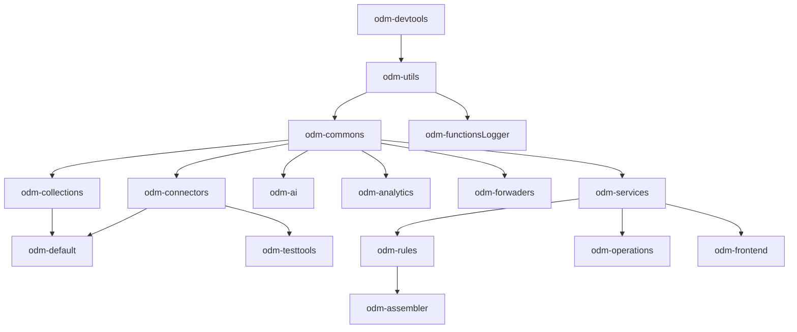

# Título de nivel 1

## Título de nivel 2

### Título de nivel 3

#### Título de nivel 4

##### Título de nivel 5

###### Título de nivel 6

> [!note] ¡Antes de esto!
> Fusionar una rama con otra (cambiar a la rama anterior previamente con un `git checkout`)

---

**Negrita** o **bold**

*Cursiva* o *italic*

***Negrita y cursiva*** o ***bold and italic***

~~Texto tachado~~

> Esto es una cita en bloque.
> 
> Puede tener varias líneas.

---
Listas:

- Elemento de lista no ordenada 1
- Elemento de lista no ordenada 2
  - Sub-elemento 1
  - Sub-elemento 2

1. Elemento de lista ordenada 1
2. Elemento de lista ordenada 2
   1. Sub-elemento 1
   2. Sub-elemento 2

---

Código en línea: `console.log('Hola Mundo');`

Bloque de código:

```javascript
let amigos = ["algo asi", "algo asa", "jiji", "jaja"]; 
console.log ("jajajaja"); 
console.log (amigos)
```


Tablas:

| First Header  | Second Header |
| ------------- | ------------- |
| Content Cell  | Content Cell  |
| Content Cell  | Content Cell  |

---

Enlaces:

[Enlace a OpenAI](https://www.openai.com)

---

Imágenes:


---

Listas de tareas:

- [x] Tarea 1
- [ ] Tarea 2
- [ ] Tarea 3

---

Referencias:

Este es un ejemplo de un [enlace de referencia][1].

[1]: https://www.example.com

---

Caracteres escapados:

\*Esto no es cursiva\*

\# Esto no es un título

---

HTML en Markdown:

<div style="color: red;">Este es un texto en rojo usando HTML.</div>


